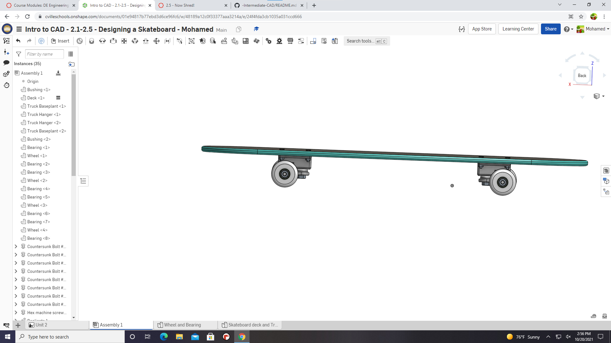
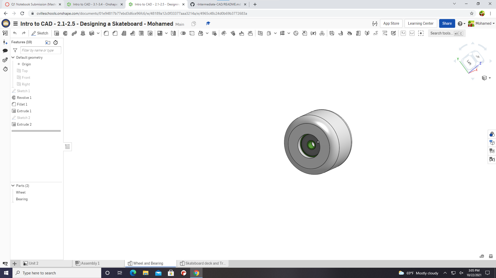
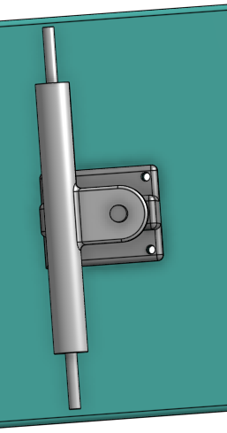
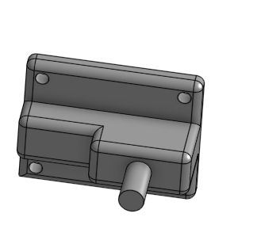
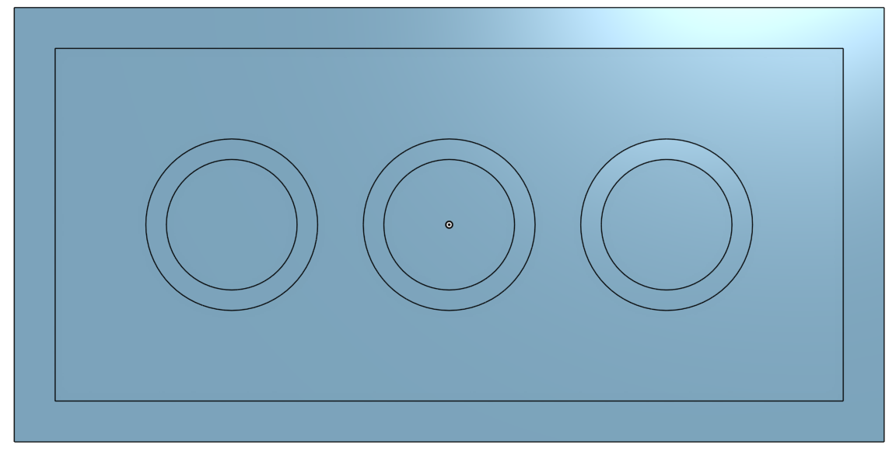
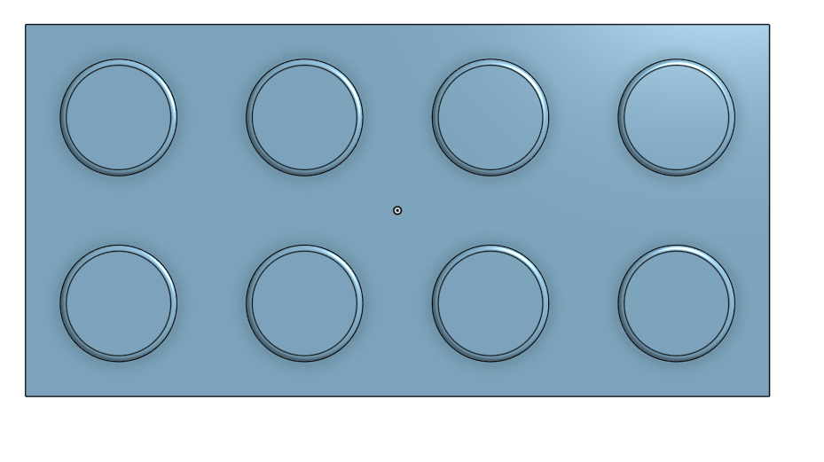

# -Intermediate-CAD
Full Skate board
## Description
this assignment that I just finished was the skateboard. It's just a skateboard, trucks,deck,wheels,bearings and everything.
I didn't know we had to submit screenshots of all th parts but I did, Here they are.
## Evidence 
https://cvilleschools.onshape.com/documents/01e94817b77ebd3d6ce96fc6/w/48189a12c0f33377aaa3214a/e/24f4fda3cb1035a031ccd666

## Image 

## Reflection
replicate and make sure to flip the piece if it doesn't look right.
## Wheels
# Evidence
https://cvilleschools.onshape.com/documents/01e94817b77ebd3d6ce96fc6/w/48189a12c0f33377aaa3214a/e/4965c48c24d0b69b3772683a
# Image

Mate connecters are very useful, make sure you click on the right places on where you want to mate.
Trucks
# Evidence
https://cvilleschools.onshape.com/documents/01e94817b77ebd3d6ce96fc6/w/48189a12c0f33377aaa3214a/e/98d7941dd7b0ddafc811c9e7
# Image

Truck Baseplant

# Evidence
https://cvilleschools.onshape.com/documents/01e94817b77ebd3d6ce96fc6/w/48189a12c0f33377aaa3214a/e/98d7941dd7b0ddafc811c9e7

# Image

Replicate is the best tool, don't forget about it, you're gonna need it when you're adding so many bolts and stuff.

# Block
## Image

## Reflection
replicate is very useful, variables are kinda easy if you remember the names, also remember to flip things if they don't look right.
